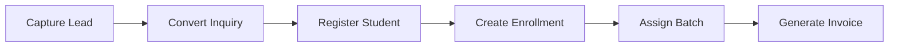

# Journey: Center Enrollment

## Public landing (parents)

Center hostname (e.g. `http://koramangala.abacusworld.localhost:9000/`) shows the shared marketing landing: parent-focused copy, phone-stage feature videos, and **Book a free trial** form (`submit_center_enrollment_lead` → `leads` table). Staff use `/login` and `/app` for operations.

See [Marketing landing pages](../frontend/marketing-landing.md).

## Staff pipeline

Success: enrollment in under 10 minutes.
