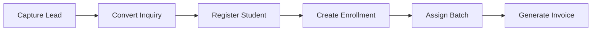

# Journey: Center Enrollment

> **Legacy note:** Parent capture on center public sites is **Path B** in [Prospective student](./prospective-student.md) (`submit_center_student_registration`). This page keeps the staff pipeline overview only.

## Public landing (parents)

Center hostname (e.g. `http://koramangala.abacusworld.localhost:9000/`) shows the brand marketing theme (Novu inline form, or Abacus/Spark **enroll modal** via `#register` / `#enroll-student`). Submit → `submit_center_student_registration` → `leads` (`lead_source = center`).

See [Marketing landing pages](../frontend/marketing-landing.md), [Spark Academy](../frontend/spark-academy.md), [Abacus Classic](../frontend/abacus-classic.md).

## Staff pipeline

```mermaid
flowchart LR
  A[Capture Lead] --> B[Convert Inquiry]
  B --> C[Register Student]
  C --> D[Create Enrollment]
  D --> E[Assign Batch]
  E --> F[Generate Invoice]
```

Success: enrollment in under 10 minutes.
