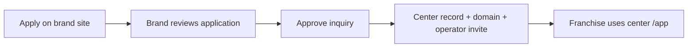

# Journey: Prospective franchise owner

Applies to **brand host** public form and **brand app** approval — not EduNudg platform signup.

## Actors

- **Franchise applicant** — wants to open a center under a brand (e.g. Abacus World)
- **Brand owner** — reviews applications, approves, provisions center

## Flow

## Steps

1. Visitor opens `http://{brand}.localhost:9000/` → **Franchise application** (`#apply`).
2. Submit → `submit_franchise_inquiry_v2` → `franchise_inquiries`.
3. Brand owner opens **Franchise Applications** (`/app/franchise-applications`).
4. **Approve** → single RPC transaction:
   - `franchise_centers` row (slug from proposed name)
   - `domain_mappings`: `{center_slug}.{brand_slug}.localhost`
   - Center operator membership + auth invite
5. Franchise operator logs in on **center host** `/app` — configures fees, kits, leads (no public franchise branding).

## Success criteria

- Applicant never uses platform or center public forms to apply.
- Center URL works immediately after approval.
- Franchise does not pay EduNudg.

## Related

- [Brand operator](./brand-operator.md)
- [Portal matrix](../spec/portal-host-matrix.md)
