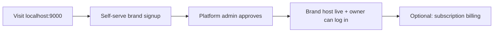

# Journey: Platform brand onboarding (EduNudg B2B)

How a **new brand customer** (e.g. Abacus World) joins EduNudg — distinct from franchise applicants joining a brand.

## Flow

## Steps

1. **Visitor** — `http://localhost:9000/` → **Start your brand on EduNudg** form (city required).
2. **RPC** — `submit_platform_brand_signup` → `platform_brand_signups` (pending).
3. **Platform admin** — `/admin/brands` → Approve from the signup requests list.
4. **Approve RPC** (single transaction):
   - `brands` row, slug `slugify(name)-slugify(city)` (+ numeric suffix if collision)
   - `domain_mappings` → `{slug}.localhost:9000`
   - `brand_subscriptions` (draft/active per ops)
   - `memberships` **brand_owner** for signup email + Supabase auth invite
5. **Brand owner** — logs in at `http://{slug}.localhost:9000/login` → `/app`.
6. **Brand marketing** — franchise + student public forms available (no subscription gate on public forms).

## Admin alternative

Platform admin may still create brands manually in `/admin/brands`; should call same `provision_brand` / approve logic where possible.

## Success

Brand marketing host and owner login work within 15 minutes of approval.

## Not this journey

- **Franchise inquiry** — person applying to open a center *under* a brand → [franchise-owner](./franchise-owner.md).

## Related

- [Portal matrix](../spec/portal-host-matrix.md)
- [FR-P01–P06](../spec/functional-requirements.md)
