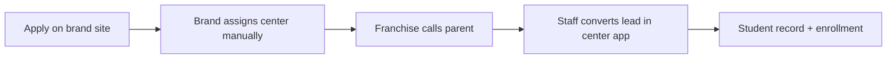

# Journey: Prospective student (parent)

Two entry paths: **brand application** (routed by brand) and **center registration** (direct to franchise).

## Path A — Brand application

1. Parent submits on `http://{brand}.localhost:9000/` — **required:** WhatsApp, city, pincode, child DOB, etc.
2. `submit_brand_student_application` → `leads` (`lead_source = brand`, `center_id` null).
3. Brand uses **Student Leads** → pincode suggestions → **manual assign**.
4. Franchise sees lead on center `/app/leads`; updates **status** (resets SLA clock).
5. Franchise **Convert** — fields prefilled per [FR-C13](../spec/functional-requirements.md#fr-c13--convert_lead_to_student-field-mapping).
6. No parent self-serve link in v1.

## Path B — Center registration

1. Parent opens `http://{center}.{brand}.localhost:9000/` → **Register** (`#register`).
2. `submit_center_student_registration` → merge by WhatsApp, `lead_source = center`.
3. Franchise converts in `/app/leads`.

## Stale & lost

- **Stale:** no center status change within `lead_stale_days` (default 15, IST) after assign → brand **Stale leads** → reallocate.
- **Lost:** **center only** marks lost with **reason**; brand views all lost leads.
- **Reopen:** **brand only** (`reopen_lead`); prior lost reason in timeline.

## Duplicate WhatsApp

Second submission **merges** into existing lead; does not reset assign unless rules in [data-flow](../spec/data-flow.md).

## Related

- [Data flow](../spec/data-flow.md)
- [Prospective student FRs](../spec/functional-requirements.md)
