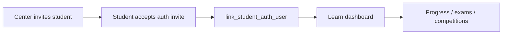

# Journey: Student learn portal

Enrolled students use `http://learn.{brand}.localhost:9000/` after center invite and auth link.

## Flow

## Steps

1. Center staff set `students.login_email` and call `invite_student_portal_access`.
2. Student authenticates on the learn host and links via `link_student_auth_user` when `user_id` is null.
3. Learn RPCs (e.g. `get_student_learn_home`) require an **active** center enrollment under the brand; otherwise UI shows contact-center guidance (`NO_ACTIVE_ENROLLMENT`).
4. Dashboard shows enrollment-scoped progress, assessments, and competitions (FR-S10+).

## Success criteria

- No learn data without active enrollment.
- Records scoped to `enrollment_id` / `center_id` / `brand_id`.
- Auth link unique per brand.

## Related

- OpenSpec: [`student-learn-portal`](../../openspec/specs/student-learn-portal/spec.md)
- [Navigation spec](../spec/navigation-spec.md)
- [Test users](../ops/test-users.md)
- [Data flow](../spec/data-flow.md) Flow 8
