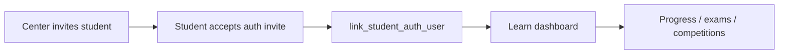

# Journey: Student learn portal

Enrolled students use `http://learn.{brand}.localhost:9000/` after center invite and auth link.

## Flow

## Steps

1. Center staff set `students.login_email` and call `invite_student_portal_access` (stores email only — does not create Auth password).
2. Learn host must resolve `brandId` (`resolveTenantScope` + `get_portal_branding`, or `learn.{brand}.localhost` in `domain_mappings`). Without `brandId`, Home is blank.
3. Student authenticates on the learn host; `resolve_student_for_learn` auto-links when Auth email matches `login_email` and `user_id` is null (center **Linked** filter then shows 1).
4. Learn RPCs require an **active** center enrollment under the brand; otherwise UI shows contact-center guidance (`NO_ACTIVE_ENROLLMENT`).
5. Pinned course (`pin_enrollment_program`) appears on Progress via `get_student_program_ladders`. Dashboard shows enrollment-scoped progress, assessments, and competitions (FR-S10+).
6. Profile **Center website** must not use raw RPC `center.public_url` (`http://*.localhost:9000/` from `domain_mappings`). Client rewrites with `resolveCenterWebsiteUrl` so Vercel opens `/?portal=center&brand=…&center=…`.

## Success criteria

- No learn data without active enrollment.
- Records scoped to `enrollment_id` / `center_id` / `brand_id`.
- Auth link unique per brand.

## Related

- OpenSpec: [`student-learn-portal`](../../openspec/specs/student-learn-portal/spec.md)
- [Navigation spec](../spec/navigation-spec.md)
- [Test users](../ops/test-users.md)
- [Data flow](../spec/data-flow.md) Flow 8
