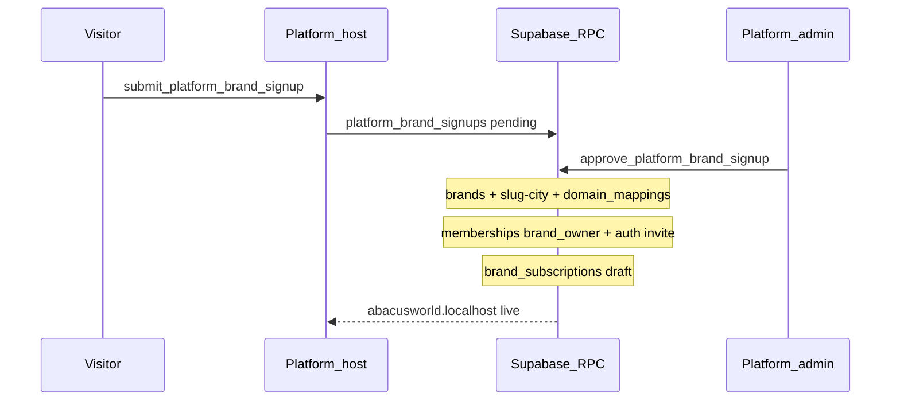
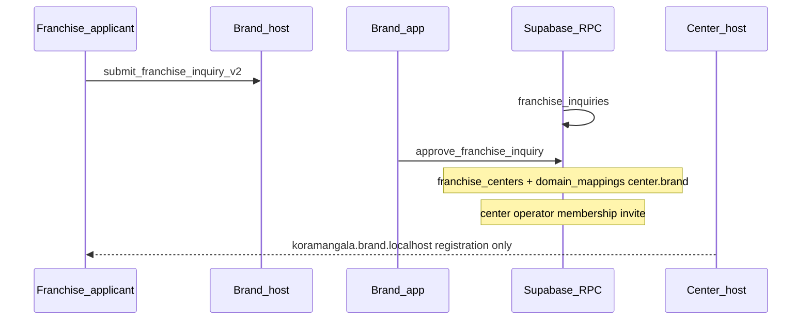
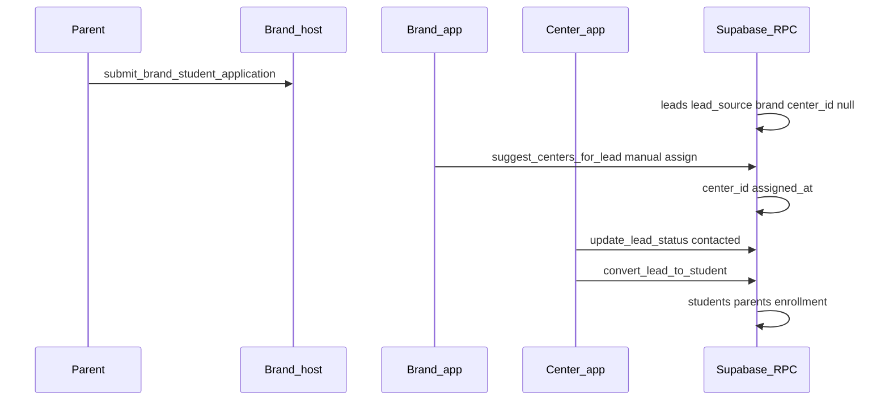
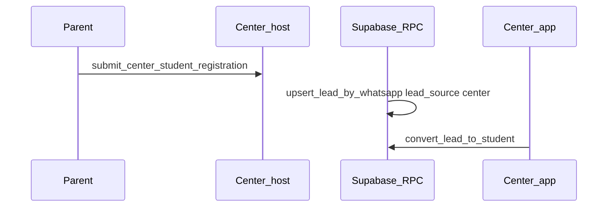
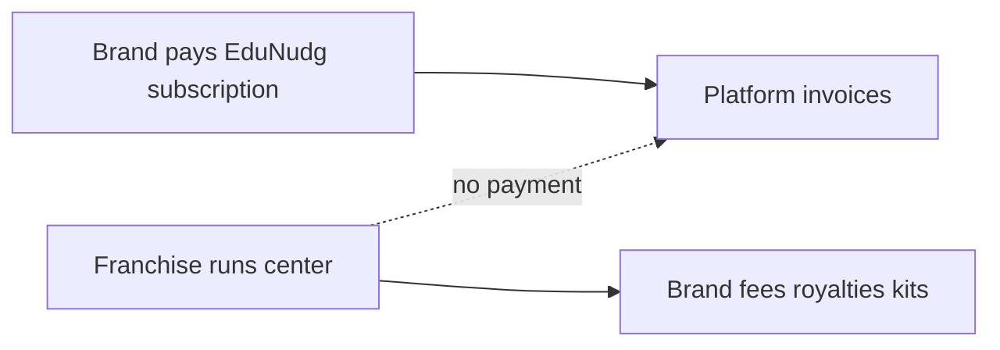

# Data flow — platform, brand, center, student

How records move between portals and tables. All public writes use **RPC**; tenant scope from hostname → `brand_id` / `center_id`.

## Entity ownership

| Entity | Owned by | Visible to |
|--------|----------|------------|
| `platform_brand_signups` | Platform | Platform admin |
| `brands`, `brand_subscriptions` | Platform creates; brand operates | Platform + that brand |
| `franchise_inquiries` | Brand | Brand staff |
| `franchise_centers`, `domain_mappings` | Brand | Brand + that center |
| `leads` | Brand (`brand_id`); optional `center_id` | Brand (all); center (assigned/direct only) |
| `students`, `student_enrollments` | Brand (`brand_id`); center operates | Brand (all centers); center (own students) |
| `memberships` | Links `auth.users` to platform/brand/center role | RLS per scope |

## Flow 1 — New brand on EduNudg (platform)

## Flow 2 — Franchise application (brand public → brand app → center host)

## Flow 3 — Student application (brand) → assign → convert (center)

## Flow 4 — Student registration direct (center host)

## Flow 5 — WhatsApp merge

| Scenario | Behaviour |
|----------|-----------|
| Same WhatsApp, second brand application | Merge fields; append `lead_events` |
| Brand apply then center register | Set `center_id` from center payload |
| Center marks `lost` | `mark_lead_lost` + `lost_reason` — **center only** |
| Brand **reopen** | `reopen_lead` — `lost` → `new`; prior reason in `lead_events` |
| WhatsApp re-apply after `lost` | Merge fields; status stays `lost` until brand reopens |
| Re-apply after `converted` | Merge notes only; do not reopen enrollment |

## Flow 6 — Stale lead (brand SLA)

1. Brand assigns → `assigned_at` (IST), compute `stale_at = assigned_at + brand_settings.lead_stale_days` (default 15).
2. Center changes `leads.status` → `last_center_action_at = now()`.
3. If `now() > stale_at` and no qualifying status change since assign → show in brand **Stale leads**.
4. Brand `reassign_lead` → new center, reset assign timestamps.

## Flow 7 — Platform revenue only

## What does not cross portals

| Data | Rule |
|------|------|
| Brand A leads | Never visible to Brand B (RLS `brand_id`) |
| Center A students | Never visible to Center B (RLS `center_id`) |
| Franchise inquiries | Not on platform or center public sites |
| Kit allocations | Center + brand only; **not** student portal |

## Related

- [RPC catalog](./rpc-catalog.md)
- [Functional requirements](./functional-requirements.md)
